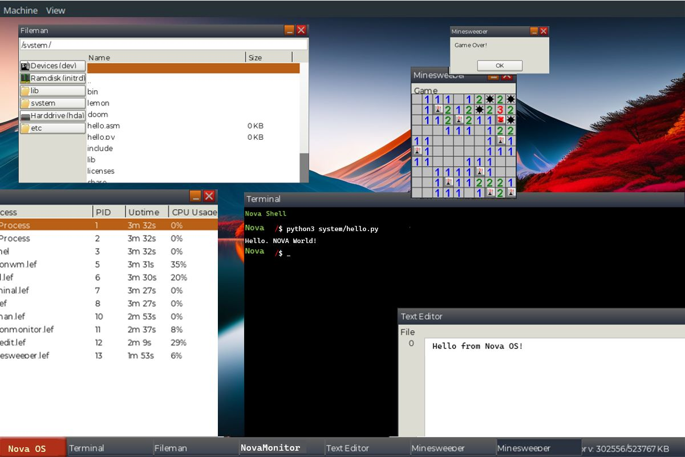

[](https://github.com/LemonOSProject/LemonOS/actions/workflows/ci.yml)

Nova Os is a UNIX-like 64-bit operating system written in C++.

## About Nova Os
Nova Os includes its own [modular kernel](Kernel) with SMP and networking, [window server/compositor](System/NovaWM) and [userspace applications](Applications) as well as [a collection of software ports](Ports).

If you have any questions or concerns feel free to open a GitHub issue, join our [Discord server](https://discord.gg/NAYp6AUYWM) or email me at computerfido@gmail.com.

## [Website](https://NovaOs.org)
## [Discord Server](https://discord.gg/NAYp6AUYWM)
## [Building Nova Os](Documentation/Build/Building-Nova-OS.md)

## Prebuilt Image
[Nightly Images](https://github.com/NovaOsProject/NovaOs/releases)

**Before running**
See [System Requirements](#system-requirements)

\
[More screenshots](Screenshots)
## Features
- Modular Kernel
- Symmetric Multiprocessing (SMP)
- UNIX/BSD Sockets
- Network Stack (UDP, TCP, DHCP)
- A small HTTP client/downloader called [steal](Applications/Steal)
- Window Manager/Server [NovaWM](System/NovaWM)
- [Terminal Emulator](Applications/Terminal)
- Writable Ext2 Filesystem
- IDE, AHCI and NVMe Driver
- Dynamic Linking
- [mlibc](https://github.com/managarm/mlibc) C Library Port
- [LLVM/Clang Port](https://github.com/NovaOsProject/llvm-project)
- [DOOM Port](https://github.com/NovaOsProject/NovaDOOM)
- [Audio Player (using ffmpeg)](Applications/AudioPlayer)

## Work In Progress
- XHCI Driver
- Intel HD Audio Driver

## Third Party

Nova Os depends on:
[mlibc](https://github.com/managarm/mlibc), [Freetype](https://freetype.org/), [zlib](https://z-lib.org/), [libressl](https://www.libressl.org/), [ffmpeg](https://ffmpeg.org/), [libfmt](https://fmt.dev), [libjpeg-turbo](https://libjpeg-turbo.org/) and [libpng](http://www.libpng.org/pub/png/libpng.html).

[Optional ports](Ports/) include LLVM/Clang, DOOM, Binutils and Python 3.8

[Various background images are located here](Base/Nova/resources/backgrounds)

## System requirements
- 256 MB RAM (512 is more optimal)
- x86_64 Processor supporting [x86_64-v2 instructions](https://en.wikipedia.org/wiki/X86-64#Microarchitecture_levels) including SSE4.2
    - For QEMU/KVM use `-cpu host` or at least `-cpu Nehalem` see [this page](https://qemu-project.gitlab.io/qemu/system/target-i386.html)
- 2 or more CPU cores recommended
- I/O APIC
- ATA, NVMe or AHCI disk (AHCI *strongly* recommended)

For QEMU run with: \
```qemu-system-x86_64 Nova.img --enable-kvm -cpu host -M q35 -smp 2 -m 1G -netdev user,id=net0 -device e1000,netdev=net0 -device ac97``` \
**KVM is strongly recommended**

## Repo Structure

| Directory          | Description                              |
| ------------------ | ---------------------------------------- |
| Applications/      | Userspace Applications                   |
| Base/              | Config, etc. Files copied to disk        |
| Documentation/     | Nova Os Documentation                   |
| Extra/             | (Currently) vector icons                 |
| InterfaceCompiler/ |  Compiler for interface definition files |
| Kernel/            | Nova Kernel                             |
| LibGUI/            | LibGUI (Windowing and widgets)           |
| LibNova/          | LibNova (Nova API)                     |
| Toolchain/         | Toolchain build scripts and patches      |
| Ports/             | Build scripts and patches for ports      |
| Resources/         | Images, fonts, etc.                      |
| Screenshots/       | Screenshots                              |
| Scripts/           | Build Scripts                            |
| Services/          | Interface definition files               |
| System/            | Core system programs and services        |
